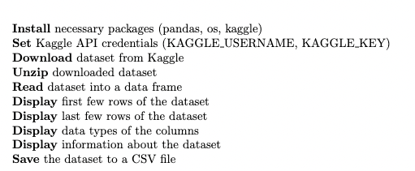

# Data Query

## Overview
This section outlines the process used in the `Data_Query.ipynb` file for querying the GPT-4 Tweets dataset from Kaggle. The dataset is pivotal for analyzing public discussions about the GPT4 language model on Twitter, aligning with our research objectives to understand public sentiment and engagement with GPT4.

## Data Query Process

### Preliminary Steps
- Install necessary packages including data manipulation and API interaction tools.
- Set up environment variables for API credentials.
- Query data from the source: [GPT-4 Tweets Dataset](https://www.kaggle.com/datasets/konradb/gpt4-the-tweets).

### Query Process
- Utilize the Kaggle API to download the GPT-4 Tweets dataset.
- Extract the dataset from its compressed format.
- Load the dataset into a data manipulation framework for initial inspection.
- Perform basic data inspection to understand the structure and type of data.
- Save the queried data into a structured file format for further analysis.

## Flowchart for Data Query


## Pseudo-Code for Data Query Process


```latex
\documentclass{article}
\usepackage{algpseudocode}
\begin{document}
\begin{algorithmic}

\State \textbf{Install} necessary packages (pandas, os, kaggle)
\State \textbf{Set} Kaggle API credentials (KAGGLE\_USERNAME, KAGGLE\_KEY)

\State \textbf{Download} dataset from Kaggle
\State \textbf{Unzip} downloaded dataset

\State \textbf{Read} dataset into a data frame
\State \textbf{Display} first few rows of the dataset
\State \textbf{Display} last few rows of the dataset
\State \textbf{Display} data types of the columns
\State \textbf{Display} information about the dataset

\State \textbf{Save} the dataset to a CSV file

\end{algorithmic}
\end{document}
