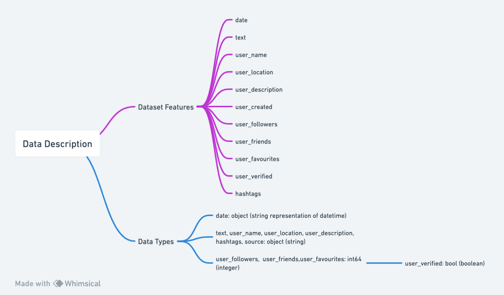

# Data Description

This dataset is accessed from the GPT-4 Tweets Dataset in Kaggle (Konrad, 2023) and comprises a collection of tweets using the hashtag #GPT4, encompassing discussions about the GPT4 language model, sharing experiences with using GPT4, or seeking assistance with GPT4-related issues. The dataset includes 28,710 tweets, providing a rich source for analyzing public perception and engagement with the GPT4 technology.

## Dataset Features

The dataset contains the following features, capturing a range of information about each tweet and its author:

- **date:** Timestamp of the tweet.
- **text:** Content of the tweet.
- **user_name:** Twitter handle of the user.
- **user_location:** Geographical location of the user, as provided in their profile.
- **user_description:** Description of the user, as provided in their profile.
- **user_created:** Date when the user's Twitter account was created.
- **user_followers:** Number of followers of the user.
- **user_friends:** Number of users the account is following.
- **user_favourites:** Number of tweets the user has liked.
- **user_verified:** Boolean indicating whether the user has a verified account.
- **hashtags:** Hashtags used in the tweet.
- **source:** The device or application used to post the tweet.

## Data Types

The dataset consists of a mix of data types, including:

- **date:** object (string representation of datetime)
- **text, user_name, user_location, user_description, user_created, hashtags, source:** object (string)
- **user_followers, user_friends, user_favourites:** int64 (integer)
- **user_verified:** bool (boolean)

## Data Structure

The dataset is structured as a pandas DataFrame with 28,710 entries and 12 columns. Each row represents a unique tweet, and the columns correspond to the features described above.

# Sample Data

**Excerpt from the Dataset:**

| date                | text | user_name | user_location | user_description | user_created        | user_followers | user_friends | user_favourites | user_verified | hashtags | source            |
|---------------------|------|-----------|---------------|------------------|---------------------|----------------|--------------|-----------------|---------------|----------|-------------------|
| 2023-04-12 20:05:08 | ...  | fuari     | Cyberspace    | beautiful together| 2022-12-27 16:50:49 | 57             | 170          | 446             | False         | NaN      | Twitter for Android |
| 2023-04-12 20:05:06 | ...  | fuari     | Cyberspace    | beautiful together| 2022-12-27 16:50:49 | 57             | 170          | 446             | False         | NaN      | Twitter for Android |
| 2023-04-12 20:05:04 | ...  | fuari     | Cyberspace    | beautiful together| 2022-12-27 16:50:49 | 57             | 170          | 446             | False         | NaN      | Twitter for Android |
| ...                 | ...  | ...       | ...           | ...              | ...                 | ...            | ...          | ...             | ...           | ...      | ...               |

# Flowchart of Dataset Structure


# Reference

Konrad B., Kaggle. GPT-4 Tweets Dataset. https://www.kaggle.com/datasets/konradb/gpt4-the-tweets. Accessed: 2024-01-28.

```bibtex
@misc{KonradB2024,
  title={GPT-4 Tweets Dataset},
  author={Konrad B.},
  year={2024},
  howpublished={\url{https://www.kaggle.com/datasets/konradb/gpt4-the-tweets}},
  note={Accessed: 2024-01-28}
}


