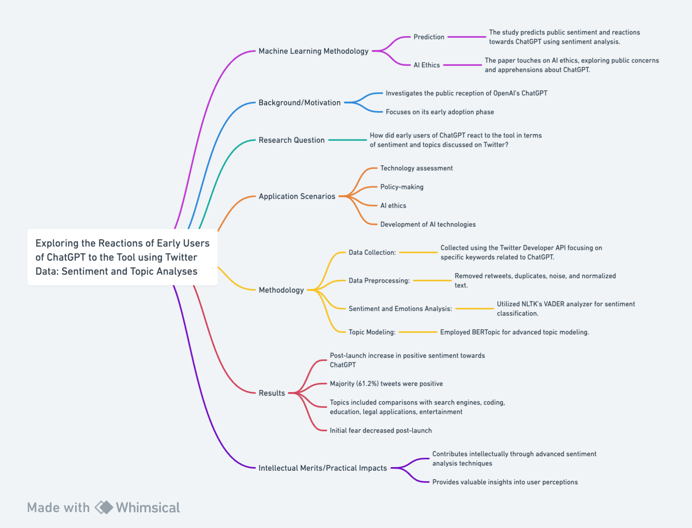
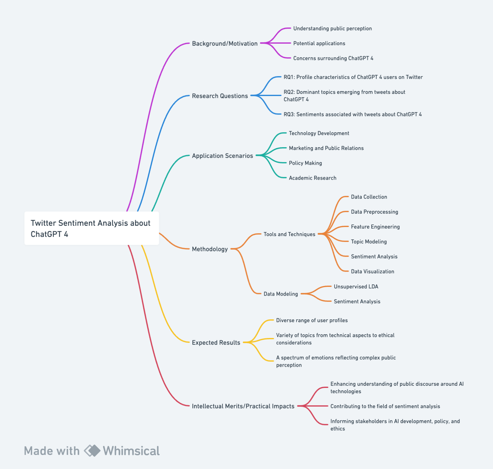

# 1.1. Exploring the Reactions of Early Users of ChatGPT to the Tool using Twitter Data: Sentiment and Topic Analyses

## Machine Learning Methodology
### Prediction
The study predicts public sentiment and reactions towards ChatGPT using sentiment analysis. By analyzing Twitter data, it forecasts the general attitude of users, categorizing it into positive, negative, or neutral sentiments. This predictive aspect is crucial for understanding how the public might receive and interact with new technologies.

### AI Ethics
The paper also touches on AI ethics, particularly in its exploration of public concerns and apprehensions about ChatGPT. By analyzing sentiments and topics, the study indirectly addresses ethical considerations such as the potential misuse of AI, privacy concerns, and the societal impact of such technologies. This aspect is vital for guiding responsible AI development and policy-making.

## Background/Motivation
The paper investigates the public reception of OpenAI's ChatGPT (OpenAI, 2022), a large language model, focusing on its early adoption phase. The motivation stems from the rapid popularity of ChatGPT and the need to understand public sentiment and concerns regarding such advanced AI technologies. This study is crucial in gauging the societal impact and potential future implications of ChatGPT.

## Research Question
The primary research question is: How did early users of ChatGPT react to the tool in terms of sentiment and topics discussed on Twitter? This question aims to uncover the general public opinion, emotional responses, and the main topics of interest or concern among early adopters.

## Application Scenarios
The study applies to scenarios where understanding public opinion on emerging technologies is vital. This includes technology assessment, policy-making, AI ethics, and the development of AI technologies themselves. It provides insights into how such technologies are perceived and can guide future improvements or address public concerns.

## Methodology
The methodology involves a mixed-method study of 463,983 tweets from early ChatGPT users. Key steps include:
1. **Data Collection:** Tweets were collected using the Twitter Developer API (Twitter Developer, 2023), focusing on specific keywords related to ChatGPT.
2. **Data Preprocessing:** This included removing retweets, duplicates, noise, and normalizing text.
3. **Sentiment and Emotions Analysis:** Utilizing NLTK's VADER analyzer and text2emotions API for sentiment classification and emotion extraction (Hutto & Gilbert, 2014; Diaz et al., 2018).
4. **Topic Modeling:** Employing BERTopic for advanced topic modeling (Egger & Yu, 2022), which provides continuous topic modeling as opposed to traditional discrete methods.

## Results
The study found that:
- Post-launch, there was a significant increase in positive sentiment towards ChatGPT.
- The majority (61.2%) of tweets were positive, with happiness being the predominant emotion.
- Topics of discussion included comparisons with search engines, coding, education, legal and managerial applications, entertainment, and problem-solving.
- There was initial fear and apprehension pre-launch, which decreased post-launch.

## Intellectual Merits/Practical Impacts
The paper contributes intellectually by applying advanced sentiment analysis and topic modeling techniques to understand public opinion on AI technologies. Practically, it provides valuable insights into user perceptions, which can inform developers, policymakers, and researchers about the societal impact of AI tools like ChatGPT. It highlights the importance of addressing ethical and legal concerns in AI development and deployment.

## Flowchart of Literature 

## References
- "Optimizing Language Models for Dialogue", 2022, [online] Available: https://openai.com/blog/chatgpt/.
- Hutto, C., & Gilbert, E. (2014, May). Vader: A parsimonious rule-based model for sentiment analysis of social media text. In Proceedings of the international AAAI conference on web and social media (Vol. 8, No. 1, pp. 216-225).
- Díaz, S. S., Shaik, J. M. M., & Santofimio, J. C. G. (2018, November). Intelligent execution of behaviors in a nao robot exposed to audiovisual stimulus. In 2018 IEEE 2nd Colombian Conference on Robotics and Automation (CCRA) (pp. 1-6). IEEE.
- Egger, R., & Yu, J. (2022). A topic modeling comparison between lda, nmf, top2vec, and bertopic to demystify twitter posts. Frontiers in sociology, 7, 886498.

# 1.2. Twitter Sentiment Analysis about ChatGPT 4

## Background/Motivation
The advent of ChatGPT 4 by OpenAI represents a significant leap in language model capabilities, sparking widespread discussions on platforms like Twitter. Analyzing these discussions is crucial for understanding public perception, potential applications, and concerns surrounding this advanced AI technology (OpenAI, 2023). This study aims to dissect Twitter data to uncover insights into how the public perceives ChatGPT 4, focusing on user profiles, dominant discussion topics, and sentiment trends.

## Research Questions
- **RQ1:** What are the profile characteristics of ChatGPT 4 users on Twitter?
- **RQ2:** What are the dominant topics emerging from tweets about ChatGPT 4?
- **RQ3:** What sentiments are associated with tweets about ChatGPT 4?

## Application Scenarios
This research has broad applications, including:
- **Technology Development:** Guiding further advancements in AI models.
- **Marketing and Public Relations:** Informing communication strategies for tech companies.
- **Policy Making:** Assisting in the creation of regulations surrounding AI technology.
- **Academic Research:** Contributing empirical data to studies in AI ethics and social sciences.

## Methodology
### Tools and Techniques
- **Data Collection:** Scraping tweets via `snscrape` (Twitter Developer API, 2023).
- **Data Preprocessing:** Involving duplication removal, lowercasing, noise removal (including punctuation, stopwords, URLs, @mentions), and lemmatization, using tools like `re`, `NLTK`, `pandas`, and `numpy` (Bird et al., 2009).
- **Feature Engineering:** Extracting geographical and datetime information from user profiles and tweets using `geopy` and `datetime`.
- **Topic Modeling:** Applying Latent Dirichlet Allocation (LDA) using `pyLDAvis` and `gensim` (Blei et al., 2003).
- **Sentiment Analysis:** Combining VADER (rule-based) from the `NLTK` library and Twitter-roBERTa (deep learning-based) from the `TRANSFORMERS` package (Hutto & Gilbert, 2014).
- **Data Visualization:** Employing `matplotlib`, `seaborn`, `wordcloud`, and `PowerBI` for visual representation of data.
- **Environments & Platforms:** Utilizing `Google Colab`, `Databricks`, `Pyspark`, `Jupyter Notebook`, and `Twitter`.

### Data Modeling
- **Unsupervised LDA:** Implemented to extract key ChatGPT topics, with the number of topics optimized for coherence.
- **Sentiment Analysis:** Employing a combination of rule-based and deep learning models to analyze the emotional tone of tweets.

## Expected Results
The study is anticipated to reveal a diverse range of user profiles engaging with ChatGPT 4, encompassing a variety of topics from technical aspects to ethical considerations. Sentiment analysis is expected to uncover a spectrum of emotions, reflecting the complex public perception of this advanced AI technology.

## Intellectual Merits/Practical Impacts
This research will enhance understanding of public discourse around AI technologies, particularly ChatGPT 4. It will contribute to the field of sentiment analysis by applying mixed-method approaches to social media data. The insights gained can inform stakeholders in AI development, policy, and ethics, shaping responsible strategies for AI advancement and deployment.

## Flowchart of Research 

## References
- OpenAI. (2023). ChatGPT 4: Overview and Capabilities. Retrieved from [https://openai.com](https://openai.com)
- Twitter Developer API. (2023). Twitter API Documentation. Retrieved from [https://developer.twitter.com](https://developer.twitter.com)
- Bird, S., Klein, E., & Loper, E. (2009). Natural Language Processing with Python. O'Reilly Media.
- Blei, D. M., Ng, A. Y., & Jordan, M. I. (2003). Latent Dirichlet Allocation. Journal of Machine Learning Research, 3, 993-1022.
- Hutto, C. J., & Gilbert, E. (2014). VADER: A Parsimonious Rule-based Model for Sentiment Analysis of Social Media Text. In Proceedings of the Eighth International AAAI Conference on Weblogs and Social Media.edia*.

